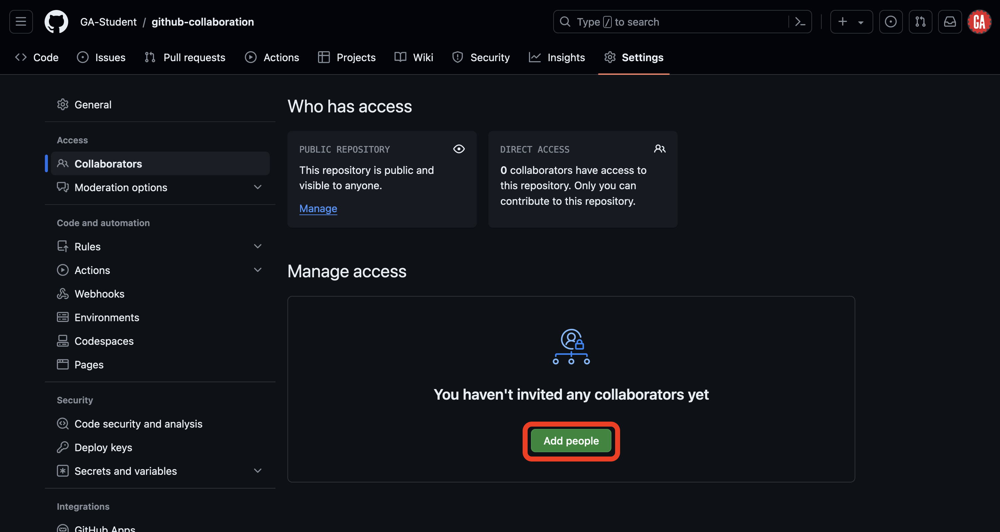
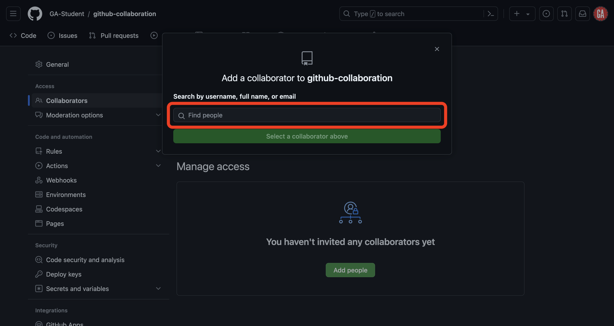
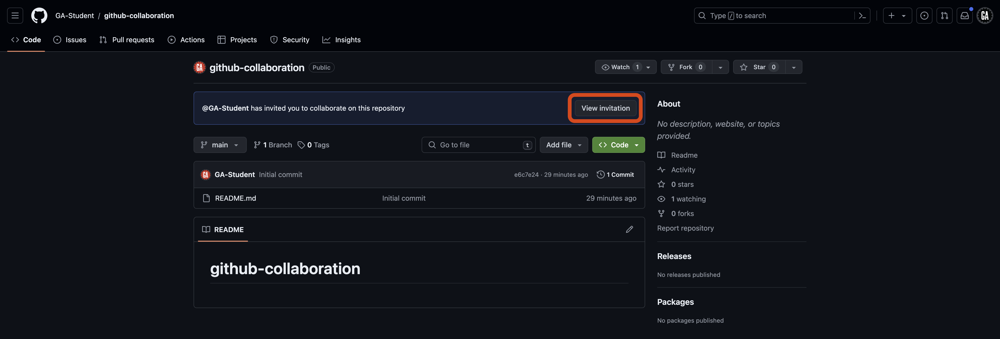

<h1>
  <span class="headline">GitHub Collaboration</span>
  <span class="subhead">Collaborator Method Add Collaborators</span>
</h1>

## About collaboration in a repository

You can collaborate with anyone on GitHub by adding them as a collaborator on a personal repository. Collaborators on a personal repository have read and write access to the code in the repository and the ability to take many other actions on the repository, as detailed [here](https://docs.github.com/en/account-and-profile/setting-up-and-managing-your-personal-account-on-github/managing-user-account-settings/permission-levels-for-a-personal-account-repository#collaborator-access-for-a-repository-owned-by-a-personal-account).

> 💡 Because of the extensive permissions they have, you should only add people you trust as collaborators on a personal repository.

You'll only need to do this setup once per repository.

## Inviting collaborators to a GitHub repo (***GitHub manager***)

> ⚠️ Only ***GitHub managers*** should complete this task.

Before you begin, you'll need the GitHub username of every programmer on your team - you should have received this information from them already.

On GitHub, navigate to the main page for the `github-collaboration` repo you created earlier.

Navigate to the repository **Settings** tab as outlined in red below. If you can't see the **Settings** tab, select the **...** dropdown menu, then select **Settings**.


Once you're in the **Settings** tab, select **Collaborators** in the left nav as outlined in red below.


As adding collaborators is a potentially dangerous action, you may be prompted to provide a password or authenticate with another method before you can add collaborators. If prompted, provide the necessary credentials to continue.

Once on the Collaborators page, you can add people as collaborators by selecting the **Add people** button outlined in red below.



A popup will appear. Type the username of the collaborator you wish to add in the search field, as shown outlined in red below.



Select the username of the person you want to add as a collaborator from the list, as shown outlined in red below. The name of your collaborator will not match what is shown in the screenshot.


Finally select the **Add person to this repository** button outlined in red below (the name on the button will match the username of the person you want to add and will look different from the screenshot).


Inform the programmer you just added as a collaborator that you've added them. They'll follow the steps outlined below to join the repo as collaborators.

Repeat this process to add people as collaborators to this repo until everyone on your team with the programmer role has been added as a collaborator. Once you've completed this, skip to the **Clone the repo** step below.

## Accept the collaboration invitation (***programmer***)

> ⚠️ Only ***programmers*** should complete this task.

After your GitHub manager invites you as a collaborator on a repository, you will receive an email similar to the one shown below (check your spam/junk folder if you don't see it). Select the **View invitation** button outlined in red below.


> 🧠 No email? Not a problem. Navigate to the repository on GitHub (get the URL from your GitHub manager) and select the **View invitation** button as outlined in red below.
>
> 

You'll be taken to a page prompting you to accept the invitation to collaborate. Accept it by selecting the **Accept invitation** button outlined in red in the screenshot below.


You are now a collaborator on the GitHub manager's repository. Congrats! Continue to the **Clone the repo** section.

## Clone the repo (***GitHub managers and programmers***)

> ⚠️ Both ***GitHub managers*** and ***programmers*** should complete this task.

Open your Terminal application and navigate to your `~/code/ga/lectures` directory:

```bash
cd ~/code/ga/lectures
```

Clone the `github-collaboration` repo to your device.

> 🚨 As always, don't clone into a directory already initialized as a git repository as this will create a nested repo.

Enter the new `github-collaboration` directory, and open it in VS Code:

```bash
cd github-collaboration
code .
```
