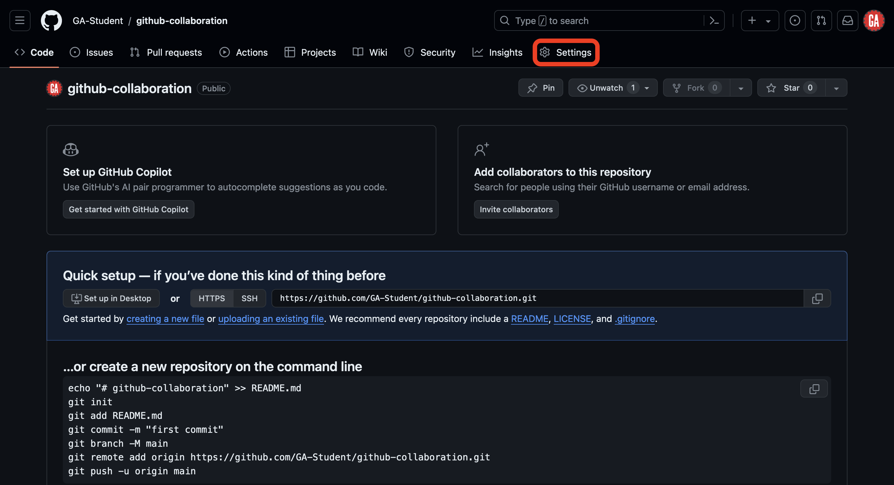
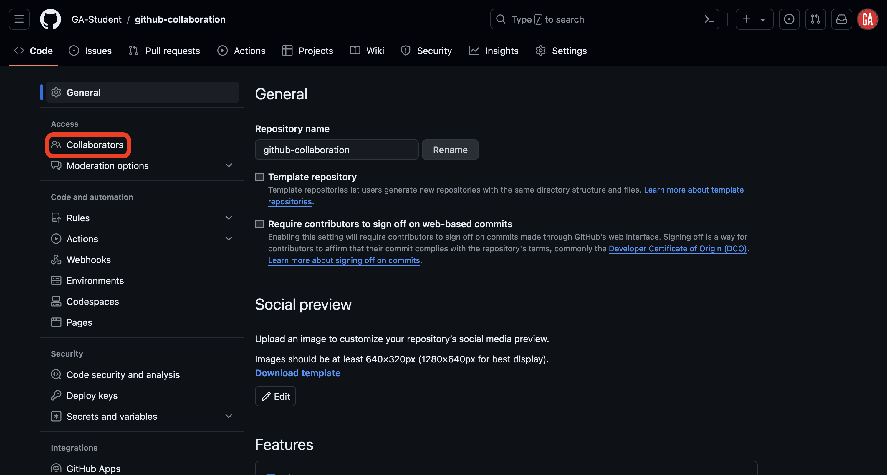
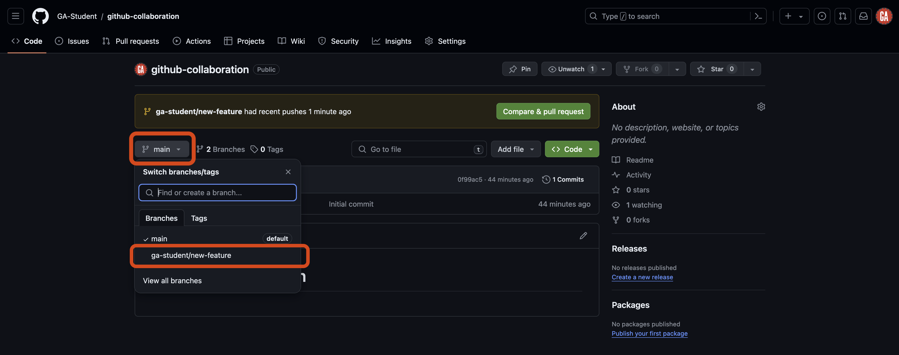
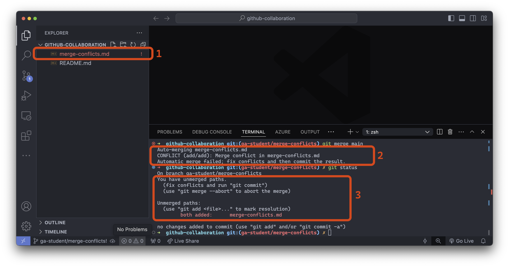
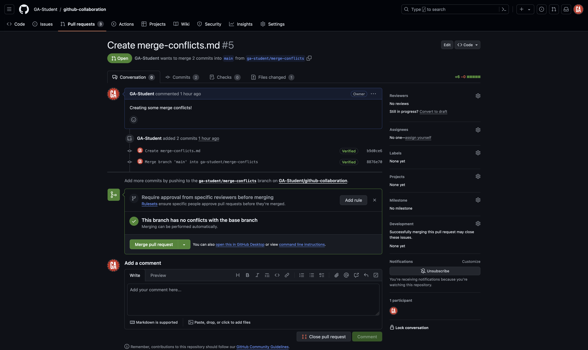

<h1>
  <span class="headline">GitHub Collaboration</span>
  <span class="subhead">Collaborator Method Cheat Sheet</span>
</h1>

## Intro

This document provides a GitHub collaboration cheat sheet for those using the single-repo collaborator method to collaborate on a project.

Note that there is very little explanation for what the commands/actions in this document specifically accomplish - refer back to the main lecture content for more thorough details.

Use the below table of contents to quickly go to the section you need.

## Content

- [Intro](#intro)
- [Content](#content)
- [Setup (once for each project)](#setup-once-for-each-project)
  - [Create a GitHub repository (***GitHub manager***)](#create-a-github-repository-github-manager)
  - [Send the GitHub manager your GitHub username (***programmer***)](#send-the-github-manager-your-github-username-programmer)
- [Add collaborators (once for each project)](#add-collaborators-once-for-each-project)
  - [Inviting collaborators to a GitHub repo (***GitHub manager***)](#inviting-collaborators-to-a-github-repo-github-manager)
  - [Accept the collaboration invitation (***programmer***)](#accept-the-collaboration-invitation-programmer)
  - [Clone the repo (***GitHub managers and programmers***)](#clone-the-repo-github-managers-and-programmers)
- [Working in branches (repeat for every new feature you add)](#working-in-branches-repeat-for-every-new-feature-you-add)
  - [Creating and checkout a branch (***GitHub managers*** and ***programmers***)](#creating-and-checkout-a-branch-github-managers-and-programmers)
  - [Write code (***GitHub managers*** and ***programmers***)](#write-code-github-managers-and-programmers)
  - [Push to the remote repo (***GitHub managers*** and ***programmers***)](#push-to-the-remote-repo-github-managers-and-programmers)
- [Creating a pull request (***GitHub managers*** and ***programmers***)](#creating-a-pull-request-github-managers-and-programmers)
  - [Comparing changes (***GitHub managers*** and ***programmers***)](#comparing-changes-github-managers-and-programmers)
  - [Open a pull request (***GitHub managers*** and ***programmers***)](#open-a-pull-request-github-managers-and-programmers)
- [Merging remotely (***GitHub managers***)](#merging-remotely-github-managers)
- [Merging locally (***GitHub managers*** and ***programmers***)](#merging-locally-github-managers-and-programmers)
  - [Create a new branch](#create-a-new-branch)
  - [Checkout an existing feature branch](#checkout-an-existing-feature-branch)
- [Fixing merge conflicts (***GitHub managers*** and ***programmers***)](#fixing-merge-conflicts-github-managers-and-programmers)

## Setup (once for each project)

### Create a GitHub repository (***GitHub manager***)

> ⚠️ Only ***GitHub managers*** should complete this task.

Create a new ***public*** repository on [GitHub](https://github.com/) with a name of your choice.

***Important***: The repository should have some contents. If making a new repository, initialize it by adding a README file.

Do not clone this repository.

### Send the GitHub manager your GitHub username (***programmer***)

> ⚠️ Only ***programmers*** should complete this task.

Send your GitHub manager your GitHub username. They will need this information to complete a later step.

## Add collaborators (once for each project)

### Inviting collaborators to a GitHub repo (***GitHub manager***)

> ⚠️ Only ***GitHub managers*** should complete this task.

Before you begin, you'll need the GitHub username of every programmer on your team - you should have received this information from them already.

On GitHub, navigate to the main page for the repo you created earlier.

Navigate to the repository **Settings** tab as outlined in red below. If you can't see the **Settings** tab, select the **...** dropdown menu, then select **Settings**.



Once you're in the **Settings** tab, select **Collaborators** in the left nav as outlined in red below.



If prompted, provide the necessary credentials to continue.

Once on the Collaborators page, you can add people as collaborators by selecting the **Add people** button outlined in red below.


A popup will appear. Type the username of the collaborator you wish to add in the search field, as shown outlined in red below.


Select the username of the person you want to add as a collaborator from the list, as shown outlined in red below. The name of your collaborator will not match what is shown in the screenshot.


Finally, select the **Add person to this repository** button outlined in red below (the name on the button will match the username of the person you want to add and will look different from the screenshot).


Inform the programmer you just added as a collaborator that you've added them. They'll follow the steps outlined below to join the repo as collaborators.

Repeat this process to add people as collaborators to this repo until everyone on your team with the programmer role has been added as a collaborator. Once you've completed this, skip to the **Clone the repo** step below.

### Accept the collaboration invitation (***programmer***)

> ⚠️ Only ***programmers*** should complete this task.

After your GitHub manager invites you as a collaborator on a repository, you will receive an email similar to the one shown below (check your spam/junk folder if you don't see it). Select the **View invitation** button outlined in red below.


> 🧠 No email? Not a problem. Navigate to the repository on GitHub (get the URL from your GitHub manager) and select the **View invitation** button as outlined in red below.
>
> 

You'll be taken to a page prompting you to accept the invitation to collaborate. Accept it by selecting the **Accept invitation** button outlined in red in the screenshot below.


You are now a collaborator on the GitHub manager's repository. Congrats! Continue to the **Clone the repo** section.

### Clone the repo (***GitHub managers and programmers***)

> ⚠️ Both ***GitHub managers*** and ***programmers*** should complete this task.

Open your Terminal application and clone the repo to your device into an appropriate location.

## Working in branches (repeat for every new feature you add)

This is where the GitHub collaboration workflow begins. This step and the ones after it are ones you will complete repeatedly throughout a project. Your project should be open in VS Code.

### Creating and checkout a branch (***GitHub managers*** and ***programmers***)

> ⚠️ Both ***GitHub managers*** and ***programmers*** will do this.

In the VS Code terminal, make sure you are in the forked and cloned repository directory.

Ensure you are in the `main` branch and have the most up to date code from the remote repository. You may need to commit the code in your current branch before you can switch to it.

```bash
git checkout main
git pull origin main
```

Modify the below command and run it:

```bash
git branch <identifier>/<new-feature>
```

> 🚨 Replace `<identifier>` (including the `<` and `>`) in the above command with an identifier that represents you - this could be your name, your GitHub username, a nickname, or something else of your choice, as long as it doesn't match the identifier someone else on your team has chosen.
>
> Replace `<new-feature>` (including the `<` and `>`) in the above command with an appropriate name for this branch. Anything concise that identifies the work being added will work great.
>
> From now on, we'll refer to this branch as `<identifier>/<new-feature>` - remember that `<identifier>` and `<new-feature>` will be different for you, and you should use the values you have chosen in place of these names. When you use commands from this content you will need to adjust these values.
>
> When collaborating in a shared repository, it's important that branch names are unique. The above pattern helps ensure that the branches you create don't conflict with the branches others on your team create.

Because we were in the `main` branch when we created it, it will be created using the `main` branch as the starting point.

> 🚨 When collaborating you will ***not*** write code in the `main` branch of a repsitory, ever. You will still interact with the main branch, but you will not write code there.

To switch to the new branch, use the below `checkout` command after modifying it:

```bash
git checkout <identifier>/<new-feature>
```

### Write code (***GitHub managers*** and ***programmers***)

> ⚠️ Both ***GitHub managers*** and ***programmers*** should complete this task.

Write code as you normally would.

Stage and commit the changes:

```bash
git add -A
git commit -m "meaningful commit message"
```

### Push to the remote repo (***GitHub managers*** and ***programmers***)

> ⚠️ Both ***GitHub managers*** and ***programmers*** should complete this task.

We need to push the branch to the remote repository to make it available on GitHub. Let's do that now. In your terminal, run the following command after modifying it:

```bash
git push origin <identifier>/<new-feature>
```

If you go to the repository on GitHub, you will see that there is now a `<identifier>/<new-feature>` branch.



## Creating a pull request (***GitHub managers*** and ***programmers***)

> ⚠️ Both ***GitHub managers*** and ***programmers*** should complete this task.

There are many different methods to create a pull request on GitHub. The steps outlined below will ensure a repeatable and consistent experience in as few steps as possible.

You will need:

- The GitHub manager's GitHub username.
- The name of the repository you're working in.

Navigate to this URL after making the necessary changes to it:

```plaintext
https://github.com/<github-username>/<repo>/compare
```

Replacing `<github-username>` (including the `<` and `>`) with the GitHub manager's GitHub username and `<repo>` (including the `<` and `>`) with the repository name.

> 💡 When working on a project for a prolonged period, it is wise to bookmark this page for easy access!

You should arrive at a page similar to the one shown below.


### Comparing changes (***GitHub managers*** and ***programmers***)

> ⚠️ Both ***GitHub managers*** and ***programmers*** should complete this task.

When you navigate to the pull request page, you will see the `Comparing changes` section. This section is where you will select the branches you want to compare. Two dropdowns in this section allow you to choose the base branch and the compare branch.

- **Base branch** - This is the branch you want to merge your changes into. This is typically the `main` branch.
- **Compare branch** - This is the branch you want to merge into the base branch. This is typically the feature branch you have been working on. In our case, it is `<identifier>/<new-feature>`. Note the arrow going from the compare branch to the base branch - this indicates the flow of your code.

You can see these dropdowns outlined in red in the screenshot below.


Select the **compare** dropdown, and select the branch you want to compare to the `main` branch. This is outlined in red in the screenshot below (although the branch name you want to compare to the `main` branch will be different). Note the search feature here - it may be necessary to use this when more branches are made in a repo.


After selecting a branch, you'll see the changes made if the pull request is merged. After you review the changes, select the **Create pull request** button outlined in red below.


### Open a pull request (***GitHub managers*** and ***programmers***)

> ⚠️ Both ***GitHub managers*** and ***programmers*** should complete this task.

You'll be taken to a new page where you can open your pull request. Here, you will give your pull request a title and brief summary.

After setting up the title and description and selecting the branches you want to compare, select the **Create pull request** button as outlined in red below. This will create the pull request and take you to the pull request page.


## Merging remotely (***GitHub managers***)

> ⚠️ Only ***GitHub managers*** should complete this task. ***Technically***, any collaborator on the repository can complete this task, but many teams find it best to have one person in charge of this work to ensure a consistent experience.

On GitHub, navigate to the repository and select the **Pull requests** tab outlined in red below.


Once on the **Pull requests** tab, select an open pull request you would like to review as shown outlined in red below:


You'll be taken to a page to view the pull request on:


Review the pull request. If there are changes that need to be made (for example if there are merge conflicts), reach out to the person who made the pull request and have them make those changes. Make sure they inform you when those changes are complete.

If everything looks good, select the **Merge pull request** button.

Inform your team members that changes have been made so that everyone on the team can complete the **Merging locally** section below.

## Merging locally (***GitHub managers*** and ***programmers***)

> ⚠️ Both ***GitHub managers*** and ***programmers*** should complete this task.

There is one more action we need to take after we merge the pull request. Everyone on the team needs to pull the changes made in the `main` branch of the remote repository to their local repo's `main` branch and then merge the changes into any work currently being done.

First, return to your terminal application. If you're have uncommitted work in a feature branch, commit your work first:

```bash
git add -A
git commit -m "meaningful commit message"
```

Checkout the `main` branch:

```bash
git checkout main
```

Then, pull the code from the `main` branch of the remote repo:

```bash
git pull origin main
```

Your local `main` branch will now contain the same code as the `main` branch of the remote repository.

From here, you can take two different paths. You will typically only choose one of these paths each time you've pulled code from the `main` branch of the remote repository:

- **Create a new branch**: Do this if you are ready to start working on a new feature.
- **Checkout an existing feature branch**: Do this if you have paused work on a feature and still have more work to do with it.

See the sections below for more details on what action to take for each path.

### Create a new branch

Use the same command you used to create a branch before:

```bash
git branch <identifier>/<new-feature>
```

You can now do work in this branch and continue contributing as normal.

### Checkout an existing feature branch

Checkout the existing feature branch:

```bash
git checkout <feature-branch-name>
```

> 🚨 Replace `<feature-branch-name>` (including the `<` and `>`) with the name of the branch you've been working in.

Bring the latest code into the feature branch so that you can use it:

```bash
git merge main
```

This command brings the changes in the main branch into your feature branch.

## Fixing merge conflicts (***GitHub managers*** and ***programmers***)

> ⚠️ Both ***GitHub managers*** and ***programmers*** should complete this task.

Checkout the `main` branch:

```bash
git checkout main
```

Then, pull the code from the `main` branch of the remote repo:

```bash
git pull origin main
```

Your local `main` branch will now contain the same code as the `main` branch of the remote repository.

Checkout the existing feature branch:

```bash
git checkout <feature-branch-name>
```

> 🚨 Replace `<feature-branch-name>` (including the `<` and `>`) with the name of the branch that is currently unable to merge with the `main` branch.

Bring the latest code into the feature branch so that you can use it:

```bash
git merge main
```

This command brings the changes in the main branch into your feature branch. Or it would, but you'll notice there is an error in your terminal. Yours will look different than this - this is just an example:

```plaintext
Auto-merging <file>
CONFLICT (add/add): Merge conflict in <file>
Automatic merge failed; fix conflicts and then commit the result.
```

The error message points out a merge conflict. To proceed, we need to fix those conflicts and then commit the result.

Before going any further, close any open file tabs in VS Code and run the `git status` command, and let's observe what we see.



1. **File explorer**: The VS Code file explorer marks any file with merge conflicts using red/orange text and an `!` to the right of the file name.
2. **Merge error message**: Informs us that the automatic merge failed and the specific files it failed for.
3. **The output of `git status`**: Informs us we have unmerged paths (the merge was unsuccessful).

Once, we've identified the problem files, open each one and fix it the conflicts.


VS Code is helping us here. There are buttons above line one that are shortcuts to resolving this conflict. We can quickly accept the current change, accept the incoming change, or accept both changes. You can also take a more nuanced approach and change the text directly to resolve the conflict manually.

> 🚨 Be cautious about the changes made here - sometimes, this process can introduce bugs into your code that you will have to manually resolve!

After you've resolved the merge conflicts, you should add, commit, and push the branch to GitHub. You should now be able to merge the pull request!


