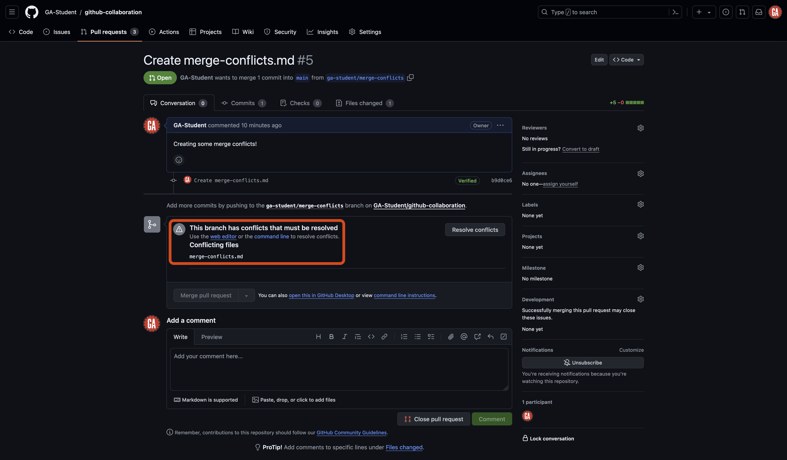
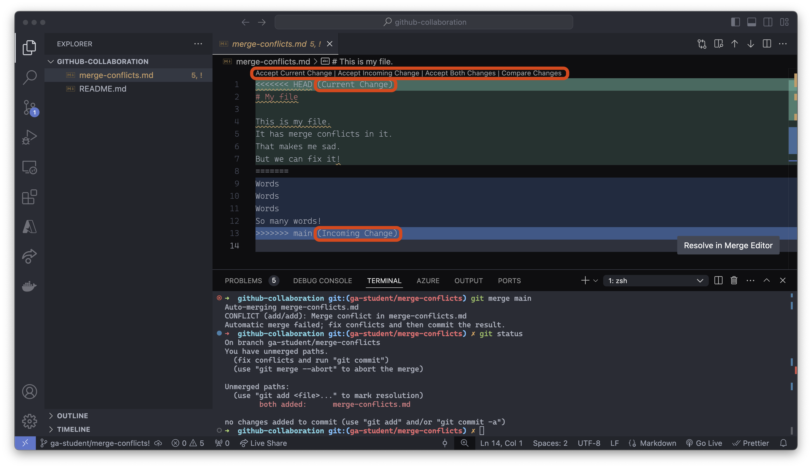

<h1>
  <span class="headline">GitHub Collaboration</span>
  <span class="subhead">Collaborator Method Merge Conflicts</span>
</h1>

**Learning objective:** By the end of this lesson, students will be able to merge branches and handle merge conflicts.

## Merge conflicts

So, what is a merge conflict? A merge conflict happens when Git cannot automatically merge the changes from one branch into another. This can occur when two branches have changed the same line of code.

> 🧠 It is much, ***much*** easier to prevent merge conflicts than fix them.

There are concrete actions you can take to help prevent merge conflicts from happening at all:

- Try to divide up work and communicate frequently so that no one changes the same file between merges. ***This is by far the best and easiest way to minimize merge conflicts.***
- Make frequent and small commits and pull requests focused on specific features.
- When you're notified that branches have been merged into the remote's `main` branch, immediately bring your local repository up to date so that you're working with the latest version of the code by following the steps in the previous **Merging** lesson.

## Create a merge conflict (***GitHub managers*** and ***programmers***)

> ⚠️ Both ***GitHub managers*** and ***programmers*** should complete this task.

Nothing we've done so far should have caused a merge conflict - ideally, everyone has been working in their own files and has communicated to avoid problems. So we'll need to create one. This will also be a good opportunity to practice the Git collaboration workflow. You will:

- **Pull the most recent code from the `main` branch of the remote repo**: We've already done this! 🎉
- **Create a new branch**: This allows you to work on a new feature without affecting the `main` branch.
- **Write and commit code**: Implement the desired feature.
- **Push the branch to GitHub**: After you've completed your work, commit your code and push the branch to GitHub.
- **Create a pull request**: Allowing you to submit your changes into the `main` branch of the remote repository.

This series of steps is the typical workflow when collaborating using Git and GitHub. You will do these steps over and over again as you implement new features into an application.

### Create a new branch

Return to this project in VS Code and open the terminal.

Start in your `main` branch if you're not already there:

```bash
git checkout main
```

Create a new branch:

```bash
git branch <identifier>/merge-conflicts
```

> 🚨 Just like before, replace `<identifier>` (including the `<` and `>`) in the above command with an identifier that represents you. Continue to do this for the remaining steps.

And checkout that branch:

```bash
git checkout <identifier>/merge-conflicts
```

### Write and commit code

Create a file called `merge-conflicts.md`:

```bash
touch merge-conflicts.md
```

Add some appropriate text to the first few lines of this file. Don't coordinate what you write with anyone else; it shouldn't match what anyone else on your team writes.

> 🧠 Everyone on the team working in the same file and adding conflicting text on the same lines will cause merge conflicts!

Commit your changes:

```bash
git add -A
git commit -m "add merge conflicts file"
```

### Push the branch to GitHub

Push the newly created branch to the remote repository:

```bash
git push origin <identifier>/merge-conflicts
```

## Create a pull request (***GitHub managers*** and ***programmers***)

> ⚠️ Both ***GitHub managers*** and ***programmers*** should complete this task.

Refer to the previous **Pull Requests** lecture to help you create a pull request. Use the branch you just pushed as the compare branch and the `main` branch as the base branch.

## Merge a pull request (***GitHub managers***)

> ⚠️ Only ***GitHub managers*** should complete this task.

After everyone has submitted their pull requests, the GitHub manager should merge one of these pull requests. Refer to the previous **Merging** lecture to help merge a pull request.

The first pull request should merge without any problems. When it is merged, no code will exist in the `main` branch of the remote repository that conflicts with any pull requests.

However, none of the other pull requests can be merged after the first pull request is merged because they will conflict with the new code in the `main` branch. When you go to the pull requests, a message will state the pull request has merge conflicts, as outlined in red below:



Before the branch can be merged, these conflicts must be resolved.

## Fixing merge conflicts (***GitHub managers*** and ***programmers***)

> ⚠️ Both ***GitHub managers*** and ***programmers*** should complete this task.

So what now? Who's responsibility is it to fix merge conflicts?

While conflicts can often be resolved in the browser by the GitHub manager, it is more common for the task of fixing merge conflicts to fall back to the contributor who submitted the pull request. After all, this is the person responsible for the committed code.

> 🧠 This does not mean that this person alone is responsible for fixing merge conflicts - it is often a very collaborative process that may require the entire team to make decisions about the final code.

Follow the steps below to resolve each merge conflict, one team member at a time, until every remaining pull request is merged.

Checkout the `main` branch:

```bash
git checkout main
```

Then, pull the code from the `main` branch of the remote repo:

```bash
git pull origin main
```

Your local `main` branch will now contain the same code as the `main` branch of the remote repository.

Checkout the existing feature branch:

```bash
git checkout <feature-branch-name>
```

> 🚨 Replace `<feature-branch-name>` (including the `<` and `>`) with the name of the branch you've been working in.

Bring the latest code into the feature branch so that you can use it:

```bash
git merge main
```

This command brings the changes in the main branch into your feature branch. Or it would, but you'll notice there is an error in your terminal:

```plaintext
Auto-merging merge-conflicts.md
CONFLICT (add/add): Merge conflict in merge-conflicts.md
Automatic merge failed; fix conflicts and then commit the result.
```

Now, our merge conflict has made its way to our local repo, where we can fix it.

The error message points out a merge conflict in the `merge-conflicts.md` file. To proceed, we need to fix those conflicts and then commit the result.

Before continuing, take a quick breather. Merge conflicts can be tricky to resolve. Take your time and make sure you understand the changes that are in conflict. Running `git status` along the way will show you the files with a merge conflict, along with the VS code user interface. This will help you keep track of the files you need to resolve.

Before going any further, close any open file tabs in VS Codw, run the `git status` command, and let's observe what we see.


1. **File explorer**: The VS Code file explorer marks any file with merge conflicts using red/orange text and an `!` to the right of the file name.
2. **Merge error message**: Informs us that the automatic merge failed and the specific files it failed for.
3. **The output of `git status`**: Informs us we have unmerged paths (the merge was unsuccessful).

Great, we identified where the problem lies; let's open the `merge-conflicts.md` file:



VS Code is helping us here. There are buttons above line 1 that are shortcuts to resolving this conflict. We can quickly accept the current change, accept the incoming change, or accept both changes. You can also take a more nuanced approach and change the text directly to resolve the conflict manually.

A merge conflict will always be broken down into the following parts:

- **Incoming Changes** - These are the changes coming in from the compare branch.
- **Current Changes** - These are the changes currently in the base branch.

The incoming changes will always be between the `<<<<<<< HEAD` and `=======` conflict markers.

The current changes will always be between the `=======` and `>>>>>>> compare-branch` conflict markers.

To resolve any conflicts, look at the file's contents and decide which changes you want to keep. In some cases, you may want to keep both changes. Once you have decided on the changes, remove the conflict markers.

> 🚨 Be cautious about the changes made here - sometimes, this process can introduce bugs into your code that you must resolve manually!

After you've resolved the merge conflict, you should add, commit, and push the branch to GitHub. The GitHub manager should now be able to merge the pull request!


Congrats, that was quite the process! 🎉
