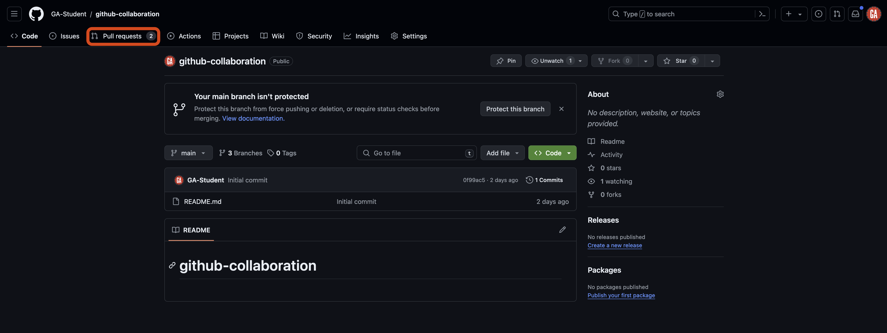
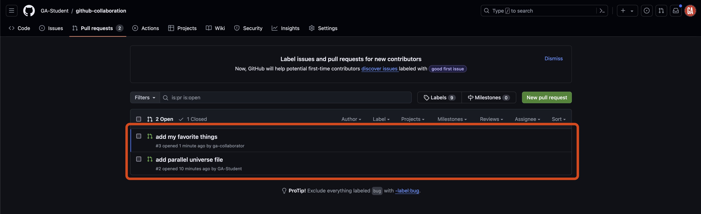
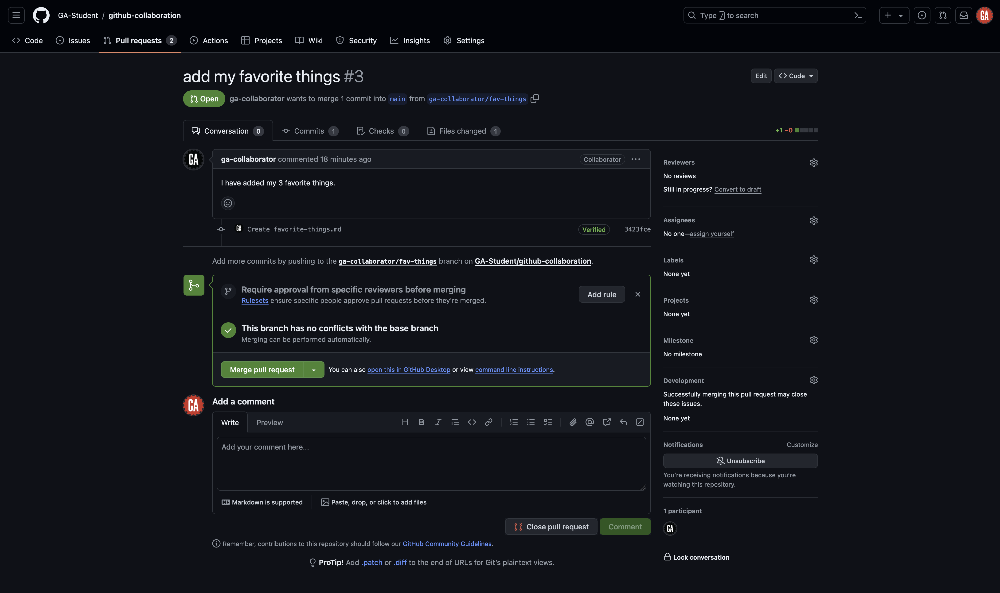
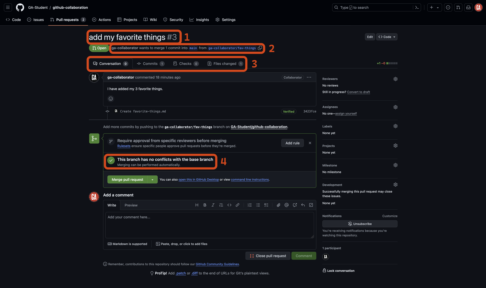
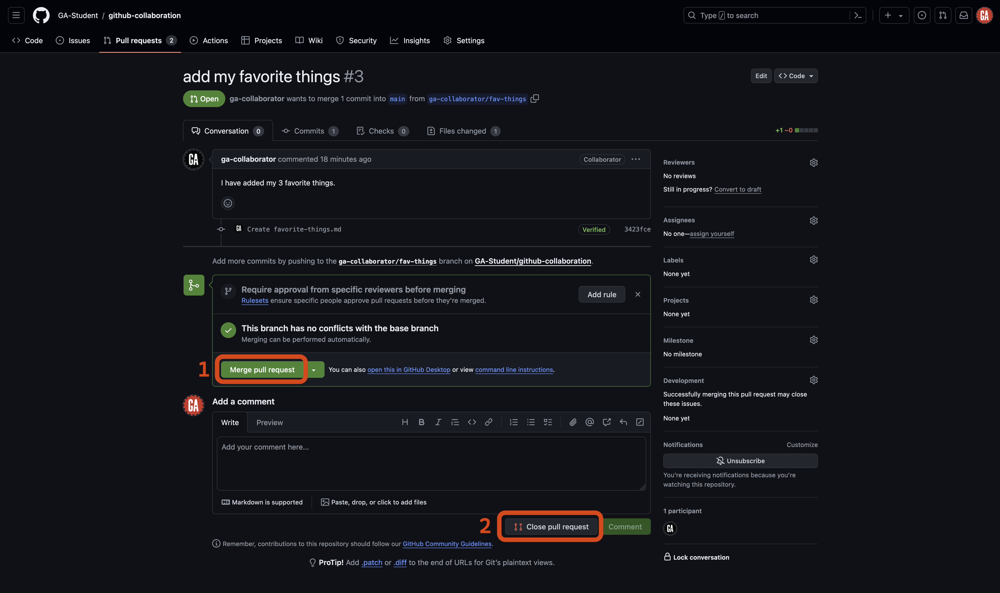
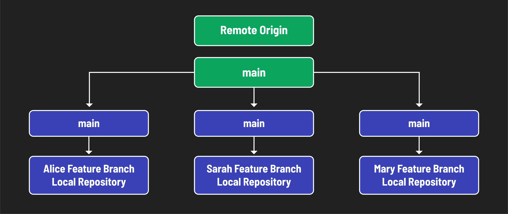

<h1>
  <span class="headline">GitHub Collaboration</span>
  <span class="subhead">Collaborator Method Merging</span>
</h1>

**Learning objective:** By the end of this lesson, students will be able to merge branches and handle merge conflicts.

## Merging

Merging is the process of combining changes from one branch into another. When you merge branches, Git will automatically determine the best way to combine the changes. However, sometimes, Git cannot automatically merge the changes, resulting in a merge conflict. In this section, we will look at merging locally and remotely.

## Merging remotely (***GitHub managers***)

> ⚠️ Only ***GitHub managers*** should complete this task. ***Technically***, any collaborator on the repository can complete this task, but many teams find it best to have one person in charge of this work to ensure a consistent experience.

Merging branches remotely is done through a pull request, which is advantageous because we have a pull request waiting for us! When merging remotely, you'll do your work on GitHub's website. Navigate to one of the pull requests created in the previous lesson by going to your `github-collaboration` repo and selecting the **Pull requests** tab outlined in red below.



Once on the **Pull requests** tab, select an open pull request you would like to review as shown outlined in red below:



You'll be taken to a page to view the pull request on:



A lot is happening on this page. Let's break it down into two parts: information on this page and actions you can take.

This page has a lot of information on it that is important to understand:



1. **Pull request title and ID**: The ID is the number of the pull request and increments by one for every pull request made. This ID makes it easy to reference a pull request on and off of GitHub.
2. **Pull request details**: These details include who made the pull request and what branches they want to merge.
3. **Pull request tabs**: Switch between these tabs to see the discussion about the pull request, the commits made as part of the pull request, and the files changed in those commits. This information is vital for understanding the impact of merging this pull request.
4. **Conflicts between the compare branch and the base branch**: If the compare branch conflicts with the base branch, you won't be able to merge it without making changes.

> 🧠 Use this information to help you review a pull request and identify the changes it will make to the base branch.
>
> If something needs to be fixed, you should communicate that with the person who made the pull request so that they can resolve the issue before you merge the changes into the base branch. They'll work in the same feature branch to make the necessary updates, then push to the remote repo when the fixes are in place - the pull request will automatically update.

Let's talk about the actions you can take:



1. **Merge pull request**: Use this to merge a pull request, bringing the work done in the compare branch into the base branch.
2. **Close pull request**: Use this to close a pull request without merging the branches. If you close a pull request, you can make a new one with the same branch later if necessary.

You should be able to select the **Merge pull request** button. When you select this button, GitHub will merge the changes from the compare branch into the base branch. That's it! You have merged the changes remotely. 🎉

Continue to merge pull requests until there are none left to merge. If you've followed along with the lecture so far, you shouldn't encounter any merge conflicts.

## Merging locally (***GitHub managers*** and ***programmers***)

> ⚠️ Both ***GitHub managers*** and ***programmers*** should complete this task.



There is one more action we need to take after we merge the pull request. Everyone on the team needs to pull the changes made in the `main` branch of the remote repository to their local repo's `main` branch and then merge the changes into any work currently being done.

> 🧠 Everyone on the team should do this after each merge to the `main` branch on the GitHub repo. This will take some adjustment, but it's the best way to ensure you're working with the newest possible code and will also help reduce the chances of submitting a pull request that contains merge conflicts.

First, return to your terminal in VS Code. If you have uncommitted work in a feature branch, commit your work first:

```bash
git add -A
git commit -m "meaningful commit message"
```

Checkout the `main` branch:

```bash
git checkout main
```

Then, pull the code from the `main` branch of the remote repo:

```bash
git pull origin main
```

Your local `main` branch will now contain the same code as the `main` branch of the remote repository.

From here, you can take two different paths. You will typically only choose one of these paths each time you've pulled code from the `main` branch of the remote repository:

- **Create a new branch**: Do this if you are ready to start working on a new feature.
- **Checkout an existing feature branch**: Do this if you have paused work on a feature and still have more work to do with it.

> ⚠️ Do not do either of these right now. The notes below are just a quick reference if you need to return to this material.

See the sections below for more details on what action to take for each path.

### Create a new branch

Use the same command you used to create a branch before:

```bash
git branch <identifier>/<feature-name>
```

> 🚨 Just like before, replace `<identifier>` (including the `<` and `>`) in the above command with an identifier that represents you. Replace `<feature-name>` (including the `<` and `>`) in the above command with an appropriate branch name identifying the feature that the branch implements.

You can now do work in this branch and continue contributing as normal.

### Checkout an existing feature branch

Checkout the existing feature branch:

```bash
git checkout <feature-branch-name>
```

> 🚨 Replace `<feature-branch-name>` (including the `<` and `>`) with the name of the branch you've been working in.

Bring the latest code into the feature branch so that you can use it:

```bash
git merge main
```

This command brings the changes in the main branch into your feature branch.

> ⚠️ When merging the newest code in the `main` branch into your feature branch, it's possible to create merge conflicts. You'll learn how to resolve merge conflicts in the next section.
