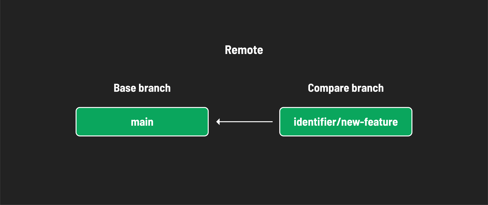
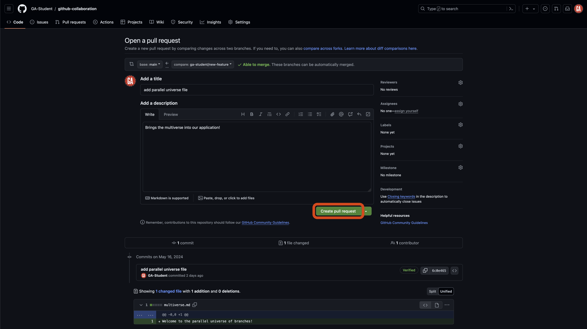

<h1>
  <span class="headline">GitHub Collaboration</span>
  <span class="subhead">Collaborator Method Pull Requests</span>
</h1>

**Learning objective:** By the end of this lesson, students will be able to submit pull requests.

## What's a pull request?

Pull requests (often abbreviated as PRs) allow developers to propose changes to a branch in a repository on GitHub. They are a way to review code and discuss changes before merging them into the main codebase. Pull requests are a central component of collaboration and allow developers to contribute their code to a larger project.

After pushing your code to a branch on GitHub (as we've already done), the next step is to integrate it into the `main` branch by creating a pull request.

## Creating a pull request (***GitHub managers*** and ***programmers***)

> ⚠️ Both ***GitHub managers*** and ***programmers*** should complete this task.

There are many different methods to create a pull request on GitHub. The steps outlined below will ensure a repeatable and consistent experience in as few steps as possible.

You will need:

- The GitHub manager's GitHub username.
- The name of the repository you're working in (`github-collaboration` for this activity).

Navigate to this URL after making the necessary changes to it:

```plaintext
https://github.com/<github-username>/<repo>/compare
```

Replacing `<github-username>` (including the `<` and `>`) with the GitHub manager's GitHub username and `<repo>` (including the `<` and `>`) with the repository name.

> 💡 When working on a project for a prolonged period, it is wise to bookmark this page for easy access!

You should arrive at a page similar to the one shown below.


### Comparing changes (***GitHub managers*** and ***programmers***)

> ⚠️ Both ***GitHub managers*** and ***programmers*** should complete this task.

When you navigate to the pull request page, you will see the `Comparing changes` section. This section is where you will select the branches you want to compare. Two dropdowns in this section allow you to choose the base branch and the compare branch.



- **Base branch** - This is the branch you want to merge your changes into. This is typically the `main` branch.
- **Compare branch** - This is the branch you want to merge into the base branch. This is typically the feature branch you have been working on. In our case, it is `<identifier>/new-feature`. Note the arrow going from the ***compare branch*** to the ***base branch*** - this indicates the flow of your code.

You can see these dropdowns outlined in red in the screenshot below.


Select the **compare** dropdown, and select the branch you want to compare to the `main` branch. This is outlined in red in the screenshot below (although the branch name you want to compare to the `main` branch will be different). Note the search feature here - it may be necessary to use this when more branches are made in a repo.


After selecting a branch, you'll see the changes made if the pull request is merged. The screenshot below shows that there will be one changed file. One line of code will be added, and no lines will be deleted. After you review the changes, select the **Create pull request** button outlined in red below.


## Open a pull request (***GitHub managers*** and ***programmers***)

> ⚠️ Both ***GitHub managers*** and ***programmers*** should complete this task.

You'll be taken to a new page where you can open your pull request. Here, you will give your pull request a title and brief summary.

1. **Title**: The title should concisely describe the change the pull request will make to the main branch, similar to a commit message. Keep it short but descriptive.

2. **Description**: Detail the changes your code will make here. This will help the reviewer understand what changes you made and why you made them.

After setting up the title and description, select the **Create pull request** button as outlined in red below. This will create the pull request and take you to the pull request page.



> 🧠 You can still create a pull request even if you cannot automatically merge your changes.

Congrats! You have created a pull request! 🎉
