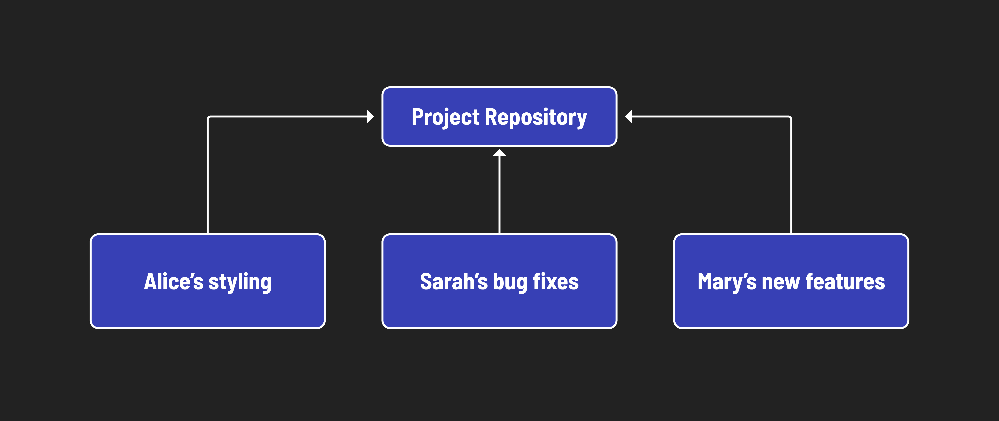

<h1>
  GitHub Collaboration
  Concepts
</h1>

**Learning objective:** By the end of this lesson, students will be able to explain why GitHub is used to collaborate across large projects or organizations.

## Collabarative Coding

Let's say you are working on a project with a team of developers. Each developer is responsible for a different part of the project. Alice is working on styling, Sarah is working on the bug fixes, and Mary is working on building features.

Each developer will write code independently, but their work needs to be integrated in a single place to create a functional application. How do you ensure that everyone's work is integrated seamlessly? This is where collaborative coding comes in. Collaborative coding involves multiple developers working together on a shared codebase. When developers collaborate on code, they use tools like Git and GitHub to manage changes, track versions, and merge contributions from different team members.

## Collaborative Coding on GitHub

Before now, we have used Git and GitHub to manage our own work. However, Git and GitHub are also powerful and popular tools for collaborating with others on a shared codebase. GitHub's popularity as a version control platform can be attributed to several key features:

- **Early adoption and network effect**: GitHub was one of the first platforms to offer a user-friendly interface for Git. Because of this, its user base grew rapidly, making it the go-to platform for many developers.
- **User-friendly interface**: GitHub's intuitive interface makes it easier for developers to manage repositories, track changes, and collaborate with others.
- **Integration with other tools**: GitHub integrates with a wide range of tools and services, making it easy to automate workflows and speed up the development processes.
- **Community and collaboration**: GitHub's large community of developers and open-source projects enables collaboration and knowledge sharing. As the community grows, this effect feeds into itself.
- **Visibility and discoverability**: Public repositories allow developers to showcase their work, contribute to open-source projects, and build a portfolio of work.

### Other collaborative coding platforms

GitHub is not the only platform for collaborative development. Other platforms, like [GitLab](https://about.gitlab.com/) and [Bitbucket](https://bitbucket.org/), offer similar features. However, GitHub is the most popular platform for open-source projects and has a large community of developers.
