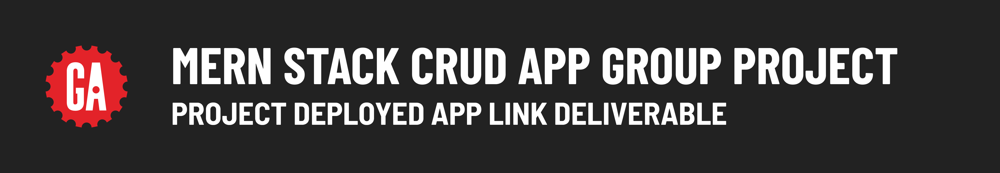

# 

## Introduction

During project week, your team will deploy the project so that others are able to use it on the internet! The back-end and front-end applications will be deployed separately.

Follow the [MEN Stack Deployment guide](https://pages.git.generalassemb.ly/modular-curriculum-all-courses/universal-resources/deployment/men-stack-deployment/) to deploy your back-end MEN Stack application.

Follow the [React Front-End Deployment guide](https://pages.git.generalassemb.ly/modular-curriculum-all-courses/universal-resources/deployment/react-front-end-deployment/) to deploy your front-end React application.

## Submitting your deployed app link

Deploy your project by following the guides above. Your team will submit a single link to your deployed front-end app below.
