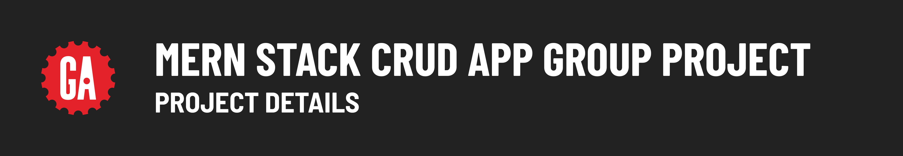

# 

## Notes and guidance

### Project recommendations

Many apps you interact with daily can provide inspiration for this project as they are full-stack CRUD apps!

Lean towards building an app that manages or tracks things that your team shares an interest in.

Avoid things like games, portfolio sites, marketing, or e-commerce sites.

### Working on a team

This project is expected to push you both technically and collaboratively. Your ability to work in a team during this project is as if not more important to your instructors at the project itself. Be a good person to your teammates!

- Share and contribute your ideas with the team.
- Listen to and respect other's opinions.
- Form a consensus and compromise when opinions differ.
- Communicate expectations early and align on a shared vision.

You will need to work on a team in the workplace, and these non-technical skills are vital to your career development - use this project to hone those skills.

This project offers one of the best opportunities you have in this course to collaborate and talk about code - one of the most important skills you can cultivate as a developer. Take advantage of it!

### Getting started

Here are some quick tips to get your project started:

- Discuss your app idea with an instructor to get feedback before your team dives too deep into planning and to make sure you're scoping your project appropriately.
- ***Keep it simple.*** Minimum Viable Product (MVP) functionality that looks great and works well is better than extra functionality added to an app without polish.
- There is not a linear correlation between how many people are on a team and how much code is written. Put another way, if you're on a team of four, don't expect your project to have four times the amount of features compared to if you were working on a project alone.
- Seriously, this cannot be stressed enough: ***keep it simple and focus on basic functionality that meets the project requirements first, before exploring more advanced features***. We're not saying this to discourage you - quite the opposite - few things do more damage to a group than unaligned expectations based on unobtainable goals. If your group heeds this advice and scopes your project appropriately your group will likely output more over the duration of this project, not less.
- Prioritize and implement user stories step-by-step, one at a time. Develop features in a way that allows you to test as you go - try your best to follow the flow of data through your app.
- When adding functionality to your back-end application, test it using Postman or a similar tool before building the UI for that feature on in your front-end app.
- Theme your app to give it a personal touch.
- Add comments to your code where it makes sense to do so. Most code is self-documenting, and you shouldn't add comments explaining the obvious. Ideally, comments should explain the ***why*** of code where it's necessary.
- Regularly review the project requirements to ensure your team is on track to pass the project. A printable version of the project requirements can be found [here](../project-requirements/assets/project-requirements.pdf).

### Project assistance

Your instructor team will provide guidelines for reaching out for help during the project.

## Presentation ideas

Your team will have a maximum of 15 minutes to present your project. While the structure and content of your presentation are ultimately up to your team, here are some potential ideas and topics to cover:

- Discuss the app. Including details about why your team chose to build this app is a nice touch.
- Use the app! Demo its features, such as CRUD.
- Share your experience with the project - what was challenging, what did you gain from building this project?
