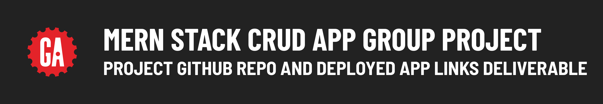

# 

## Contents

**Deliverable details**:

- GitHub repo deliverables
- Deployed app link deliverable

**Submitting deliverables**:

- Submitting your deliverables

## GitHub repo deliverables

After your project proposal has been approved, your team will need to designate someone to set up the two main GitHub repos for your project - one for the front-end and another for the back-end.

> 🚨 As a reminder, you should use the same front-end and back-end repos or keep all the repos you use for the entire duration of your project to meet the project requirements.

## Deployed app deliverable

During project week, your team will deploy the project so that others are able to use it on the internet! The back-end and front-end applications will be deployed separately.

Follow the [MEN Stack Deployment guide](https://pages.git.generalassemb.ly/modular-curriculum-all-courses/universal-resources/deployment/men-stack-deployment/) to deploy your back-end MEN Stack application.

Follow the [React Front-End Deployment guide](https://pages.git.generalassemb.ly/modular-curriculum-all-courses/universal-resources/deployment/react-front-end-deployment/) to deploy your front-end React application.

## Submitting your deliverables

Follow the guidelines below to submit your deliverables for this project.

### Submitting your GitHub repo links

Your team will submit a single link to the main ***public*** GitHub repos that you are using for the front-end and back-end of your MERN Stack CRUD App Group Project below in the following format:

```plaintext
Front-end GitHub repo link: <link>
Back-end GitHub repo link: <link>
```

Replacing `<link>` (including the `<` and `>`) with a link to your front-end and back-end GitHub repos.

### Submitting your deployed app link

Deploy your project by following the guides above. Your team will submit a single link to your deployed front-end app below in the following format:

```plaintext
Deployed project link: <link>
```

Replacing `<link>` (including the `<` and `>`) with a link to your deployed front-end app.
