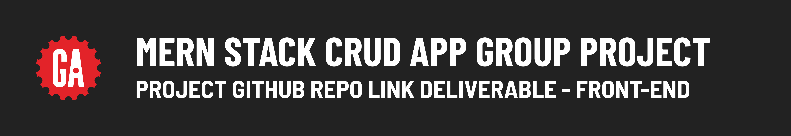

# 

## Introduction

After your project proposal has been approved, your team will need to designate someone to set up the main GitHub repo for the front-end of your project.

> 🚨 As a reminder, you should use the same repo or keep all the repos you use for the entire duration of your project to meet the project requirements.

## Submitting your GitHub repo link

Your team will submit a single link to the main ***public*** GitHub repo that you are using for the front-end of your MERN Stack CRUD App Group Project below.
