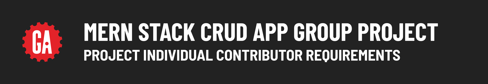

# 

## Individual contributor requirements

In addition to the group evaluation, you will also be graded individually on this project based on the requirements outlined below. ***It is possible for your group as a whole to pass the project but for you not to pass individually - do not let this happen!***

A printable version of the project requirements can be found [here](./assets/project-ic-requirements.pdf).

### Git and GitHub

> ✅ Any items marked incomplete in this section will require you to use your one redo to re-submit them. Your interactions with Git and GitHub must fulfill the below requirements.

- It should be apparent that you were a significant contributor to this project by reviewing the analytics that track commit count and lines modified in a repository in GitHub.
- Do not artificially inflate your commit count by excessively committing minor changes to the project.
- You should have commits across the front-end and back-end applications.
- Your commit messages should be descriptive of the work done in that commit.

### Presentation

> ✅ Any items marked incomplete in this section will require you to use your one redo to re-submit them.

- You must contribute to your group's presentation by demonstrating a feature you built during project week.

## Individual contributor evaluation

- Your instructors will use the above guidelines to determine whether you met this project's individual contributor requirements.
- If your instructors determine that you did not meet the minimum requirements, you may be provided the opportunity to address the deficiencies identified and re-submit the project. However, be aware that **there is only a single opportunity to re-submit a project during the course**. Please reach out to your student success specialist if you have questions.
