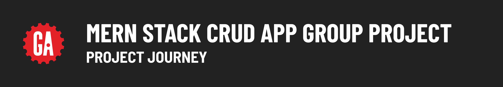
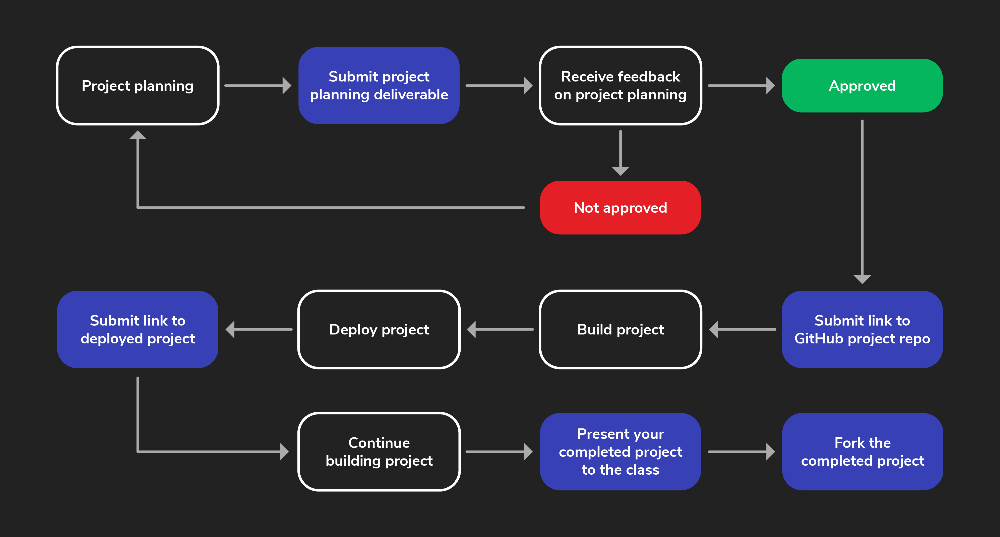

# 

Project week is when students typically learn the most. During this week you'll have fewer lectures and deliverables that are not related to your project. Instead, you'll primarily be self-directed to plan, build, and complete your project with your team.

Your team will need to submit some key deliverables along the way to keep on track. Finally, at the end of project week your entire team will present your completed project to the class.

To help you through this process, we've included this guide to walk you through the individual steps outlined below (and shown above) so that you can be sure you're not missing anything along the way.

## Project info

Before your team starts planning, review the [project requirements](../project-requirements/README.md) together to ensure everyone on the team understands what features must be implemented in your project. Then, review the [Project Details](../project-details/README.md), which includes helpful tips to get started.

In addition to the group evaluation, you will also be graded individually on this project. ***It is possible for your group as a whole to pass the project but for you not to pass individually - do not let this happen!***

See the [individual contributor project requirements](../project-individual-contributor-requirements/README.md) for more details about the individual requirements.

## 1. Project planning

Project week starts with project planning. For more details and the specific requirements, see the [MERN Stack CRUD App Group Project Deliverables](../project-deliverables/README.md).

When your team submits your project planning materials your proposal will either be approved, or you'll receive feedback and be asked to make adjustments before a final approval can be given.

## 2. Create a GitHub repo

Once your team's project proposal is approved, create the public GitHub repos that you'll use for the project. See the [MERN Stack CRUD App Group Project Deliverables](../project-deliverables/README.md) for more details.

## 3. Build the project

The fun part! Your team starts building your project!

## 4. Deploy the work you have so far

During project week, your team will deploy your project to the internet and submit a link to your deployed app. See the [MERN Stack CRUD App Group Project Deliverables](../project-deliverables/README.md) for more details.

Continue working on your project until presentation day.

## 5. Present your project

Project week ends with your group giving a presentation of your project!

## 6. Fork the project

After you've completed the project, create a fork of it if you haven't already so that you have your own copy.
